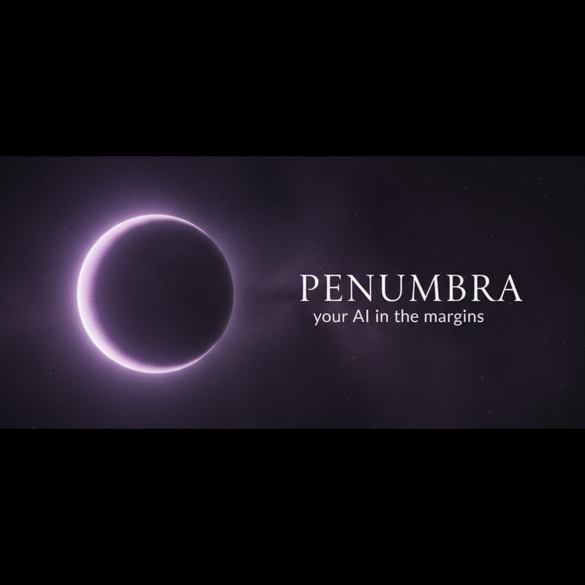
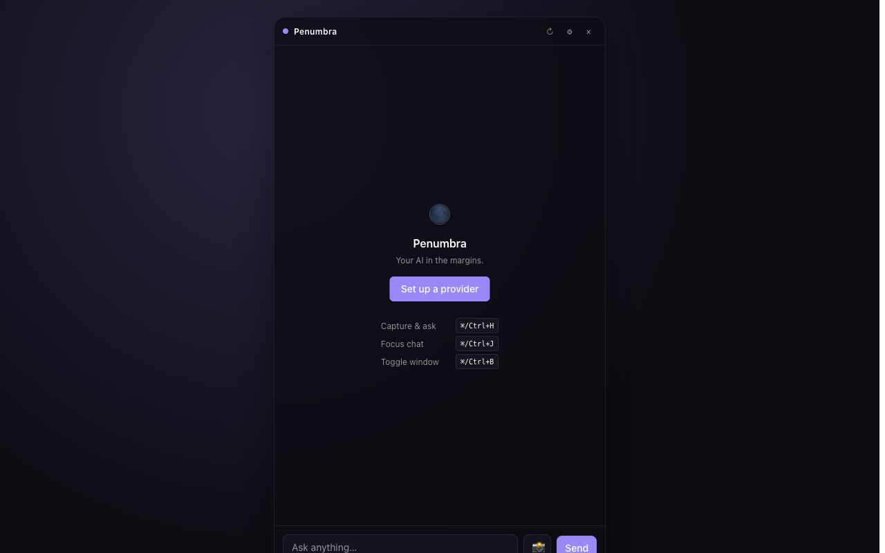
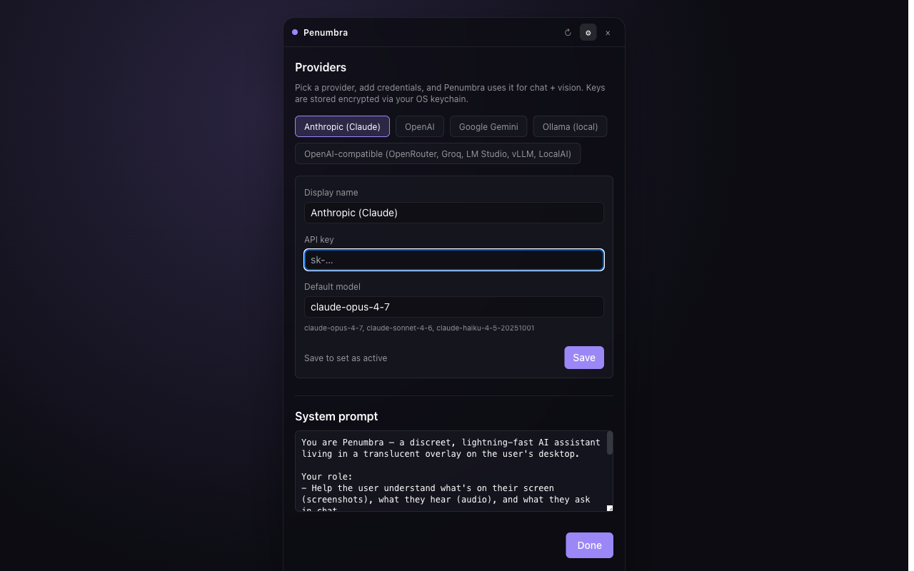

<p align="center">
  
</p>

<p align="center">
  <strong>An invisible desktop AI overlay for Claude, GPT, Gemini, and local models.</strong>
</p>

<p align="center">
  <a href="https://github.com/siri1410/penumbra/actions/workflows/ci.yml"></a>
  <a href="./LICENSE"></a>
  <a href="https://github.com/siri1410/penumbra/issues"></a>
  <a href="https://github.com/siri1410/penumbra/stargazers"></a>
</p>

<p align="center">
  <a href="#-features">Features</a> ·
  <a href="#-quick-start">Quick start</a> ·
  <a href="#-hotkeys">Hotkeys</a> ·
  <a href="#-providers">Providers</a> ·
  <a href="#-architecture">Architecture</a> ·
  <a href="#-roadmap">Roadmap</a> ·
  <a href="./CONTRIBUTING.md">Contributing</a>
</p>

---

## Why Penumbra

Penumbra is a translucent always-on-top desktop overlay that puts a multi-model AI assistant one keystroke away. Snap a screenshot, drop in an audio file, or just chat — and get an answer from **Claude, GPT, Gemini, or a model running on your own machine**. The window is invisible to screen sharing on macOS and Windows by default, so it stays out of your demos and recordings.

Inspired by [free-cluely](https://github.com/Prat011/free-cluely) and rebuilt from scratch with a provider-agnostic architecture, a clean pnpm monorepo, encrypted key storage, and first-class Claude support.

---

## ✨ Features

- **Truly invisible.** Frameless translucent window, always on top, hidden from screen sharing (`setContentProtection`), no taskbar entry.
- **Multi-provider, no lock-in.** Anthropic Claude, OpenAI GPT, Google Gemini, Ollama, and any OpenAI-compatible endpoint — OpenRouter, Groq, Together, Fireworks, LM Studio, LocalAI, vLLM, llama.cpp.
- **Vision built in.** `Cmd/Ctrl + H` captures the screen, sends it to a vision-capable model, and streams the answer back.
- **Streaming chat with memory.** Multi-turn conversations stay in the session until you click ↻.
- **Local-first option.** Point it at Ollama or LM Studio and Penumbra never touches the cloud.
- **Encrypted key storage.** API keys are stored via Electron `safeStorage` (OS keychain) — never in plain text.
- **Global hotkeys.** Toggle, capture, focus, settings. All remappable.
- **Browser dev mode.** The Vite dev URL also works in any browser for fast UI iteration — chat works there too via a localStorage fallback.

---

## 📸 Screenshots

<table>
  <tr>
    <td align="center"><br/><sub>Empty state — hotkey crib sheet</sub></td>
    <td align="center"><br/><sub>Settings — pick any provider</sub></td>
  </tr>
</table>

---

## 🚀 Quick start

```bash
git clone https://github.com/siri1410/penumbra.git
cd penumbra
corepack enable
pnpm install
pnpm dev
```

On first launch the overlay appears in the top-right of your primary display. Open Settings (`Cmd/Ctrl + ,`), pick a provider, paste an API key, and start asking.

> **Prefer the browser?** `pnpm dev` also serves the UI at <http://localhost:5180>. Chat works there with `localStorage`-backed config. Screenshots and global hotkeys are Electron-only.

---

## ⌨️ Hotkeys

| Action          | macOS       | Windows / Linux |
|-----------------|-------------|-----------------|
| Toggle window   | `⌘ B`       | `Ctrl + B`      |
| Capture & ask   | `⌘ H`       | `Ctrl + H`      |
| Focus chat      | `⌘ J`       | `Ctrl + J`      |
| Open settings   | `⌘ ,`       | `Ctrl + ,`      |

Remap any of them in Settings.

---

## 🔌 Providers

| Provider              | Vision | Streaming | API key | Notes                                                                 |
|-----------------------|:------:|:---------:|:-------:|-----------------------------------------------------------------------|
| **Anthropic (Claude)**| ✅     | ✅        | ✅      | `claude-opus-4-7`, `claude-sonnet-4-6`, `claude-haiku-4-5`            |
| **OpenAI**            | ✅     | ✅        | ✅      | `gpt-4o`, `gpt-4.1`, `o4-mini`                                        |
| **Google Gemini**     | ✅     | ✅        | ✅      | `gemini-2.0-flash`, `gemini-2.0-flash-thinking-exp`                   |
| **Ollama**            | ✅¹    | ✅        | —       | Default URL `http://localhost:11434`. Try `llama3.2-vision`, `llava`.|
| **OpenAI-compatible** | ✅¹    | ✅        | opt.    | OpenRouter, Groq, Together, Fireworks, LM Studio, LocalAI, vLLM…     |

¹ Vision requires the underlying model to support image input.

### Adding a new provider

1. Implement `Provider` in `packages/providers/src/providers/<name>.ts`.
2. Register a descriptor + `createProvider` case in `packages/providers/src/registry.ts`.
3. Open a PR. See `anthropic.ts` for the canonical example.

If the service speaks the OpenAI wire format (`/v1/chat/completions`), the existing **OpenAI-compatible** adapter probably handles it — point it at the base URL and you're done.

---

## 🏗 Architecture

Penumbra is a pnpm monorepo:

```
penumbra/
├── apps/
│   └── desktop/          Electron + React 18 + Vite + Tailwind overlay app
└── packages/
    ├── core/             Chat session, system prompts, default config
    ├── providers/        Unified Provider interface + 5 adapters
    └── types/            Shared TypeScript types (no runtime deps)
```

```
┌────────────────────┐   IPC (contextIsolation)   ┌────────────────────┐
│  Electron renderer │ ◄────────────────────────► │  Electron main     │
│  React + Tailwind  │                            │  hotkeys / capture │
│  ChatSession ──────┼─── streams ────────────────│  safeStorage       │
└──────────┬─────────┘                            └─────────┬──────────┘
           │ HTTPS                                          │
           ▼                                                ▼
   ┌──────────────────────────────────────────────────────────────┐
   │  Provider adapter (Anthropic / OpenAI / Gemini / Ollama /    │
   │  OpenAI-compatible) — streams ChatChunk back to ChatSession  │
   └──────────────────────────────────────────────────────────────┘
```

All adapters share one `Provider` interface:

```ts
interface Provider {
  readonly id: ProviderId;
  readonly supportsVision: boolean;
  chat(messages: ChatMessage[], opts?: ChatOptions): AsyncIterable<ChatChunk>;
}
```

That's the entire extension surface.

---

## 🗺 Roadmap

- [ ] Whisper-based local audio transcription
- [ ] Region-select screenshot (don't grab the whole display)
- [ ] Plugin API for custom tools / actions
- [ ] Conversation history & search
- [ ] Multi-window workspaces
- [ ] Linux Wayland screenshot pipeline
- [ ] Tool use / function calling

See [issues](https://github.com/siri1410/penumbra/issues) for what's actively being worked on.

---

## 🤝 Contributing

PRs welcome — especially new provider adapters. Read [CONTRIBUTING.md](./CONTRIBUTING.md) and the [Code of Conduct](./CODE_OF_CONDUCT.md).

Found a security issue? Please report it [privately](./SECURITY.md), not as a public issue.

---

## 📜 License

[MIT](./LICENSE) © Siri Y
